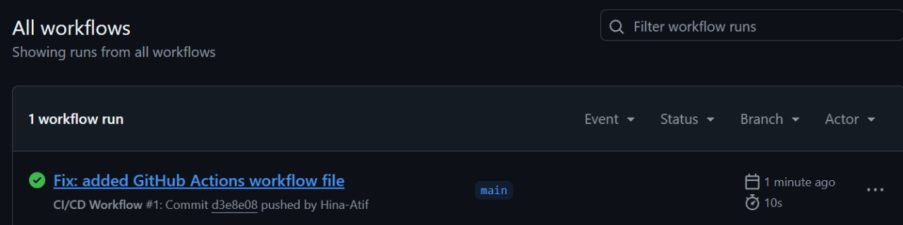
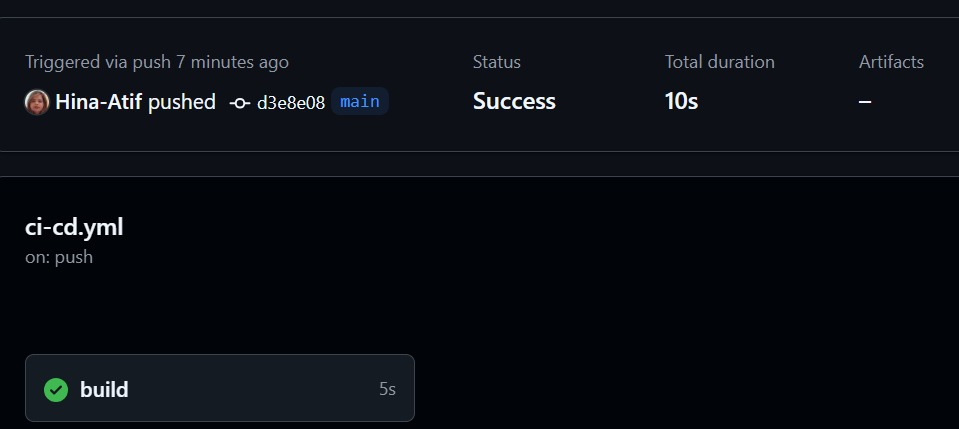
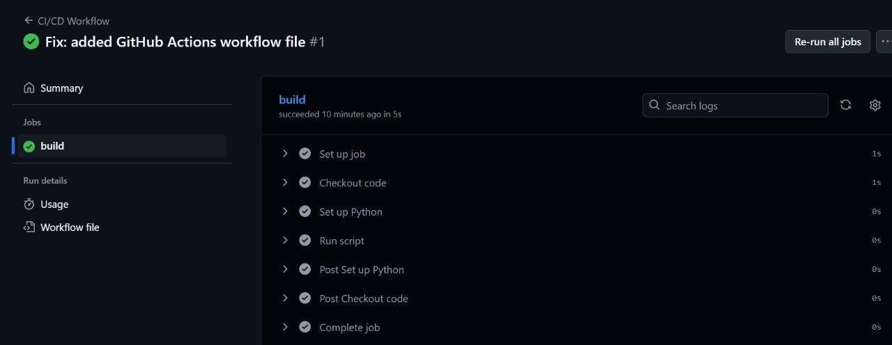
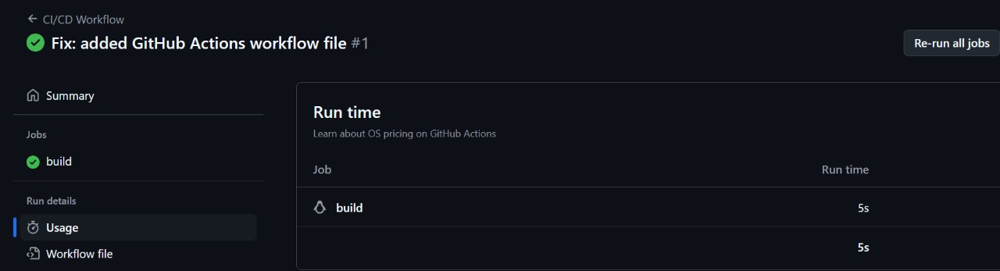

# 🚀 GitHub Actions CI/CD Workflow – By Hina Atif

This project demonstrates a beginner-level **CI/CD pipeline using GitHub Actions**.  
Whenever new code is pushed to the repository, GitHub Actions triggers a workflow to run a Python script — showcasing automation, DevOps basics, and CI/CD concepts.

---

## 🙋‍♀️ About Me

Hi, I’m **Hina Atif**, an aspiring DevOps Engineer building my GitHub portfolio to break into the cloud and automation field.

🔗 GitHub Profile: [github.com/Hina-Atif](https://github.com/Hina-Atif)

---

## 🛠️ Tech Stack

| Tool           | Purpose                            |
|----------------|------------------------------------|
| GitHub Actions | CI/CD Automation Workflow          |
| Python         | Simple script execution            |
| YAML           | Workflow configuration             |
| Git + VSCode   | Version Control + Development IDE  |

---

## 📁 Project Structure

github-actions-cicd-workflow/
├── .github/
│ └── workflows/
│ └── ci-cd.yml
├── app.py
├── README.md
└── assets/
├── screenshot-1-workflow-triggered.png
├── screenshot-2-success-status.png
├── screenshot-3-log-output.png
└── screenshot-4-my-extra.png

---

## 🖼️ Screenshots

### 📌 1. Workflow Triggered

### ✅ 2. Passed Status

### 📋 3. Log Output (Message printed from GitHub Actions)

### 💡 4. Extra Screenshot (Your custom capture)

---

## ✅ Outcome

- GitHub Actions runs the CI/CD pipeline automatically on push.
- Python script runs in a virtual environment.
- Logs and results are displayed in GitHub Actions tab.
- Project reflects knowledge of real-world DevOps automation basics.

---

## 📌 How to Reuse This Project

1. Fork this repo or copy its structure.
2. Add your own Python or other app.
3. Customize the workflow inside `.github/workflows/ci-cd.yml`.
4. Push to GitHub and see the CI/CD magic happen!

---

## ✨ Created By

**Hina Atif**  
🌐 GitHub: [github.com/Hina-Atif](https://github.com/Hina-Atif)

